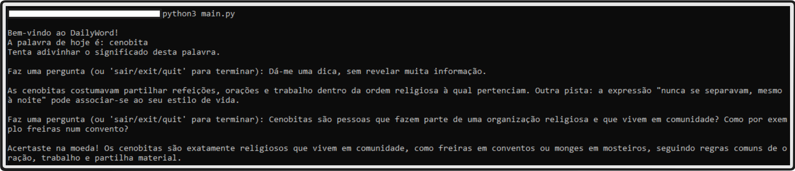

# DailyWord

A simple Portuguese word guessing game based on the [Priberam](https://dicionario.priberam.org/) "Palavra do dia" that uses the Groq API to help users discover the meaning of the daily word.

This is a really simple project that came to mind because me and my colleagues at work play this little game when we meet in the office. Usually it would be me giving tips and they trying to guess but now we can all play together :).

## How it works

The game fetches today's word from Priberam and you can ask questions about it. The AI gives you hints without spoiling the answer.

Here's an example of how it looks:

## Setup

1. Install dependencies: `pip install -r requirements.txt`
2. Add your Groq API key to `env.py`
3. Run with `python main.py`